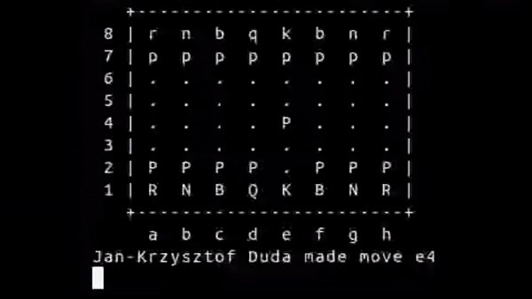

#### ES-Chess

Sample implementation of command line chess game based on the Event Sourcing. 


### Available commands

Create new game
```
php bin/console chess:start PLAYER1_NAME PLAYER2_NAME GAME_NAME
```
Make new move
```
php bin/console chess:move GAME_ID PLAYER_NAME MOVE
```
Give up  a game
```
php bin/console chess:give_up GAME_ID PLAYER_NAME
```

### Installation

```
cp .env.example .env
composer install
php bin/console doctrine:migrations:migrate
```


